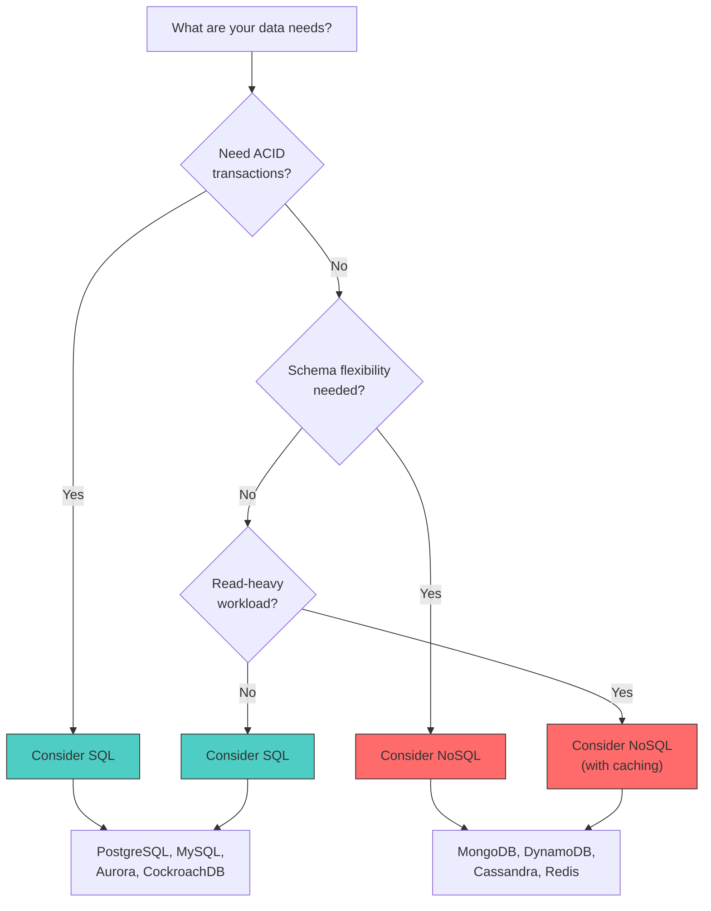
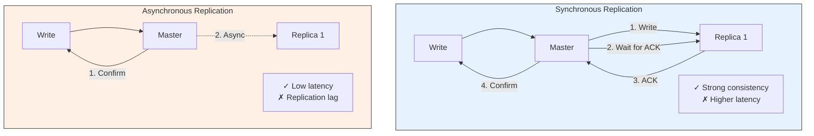
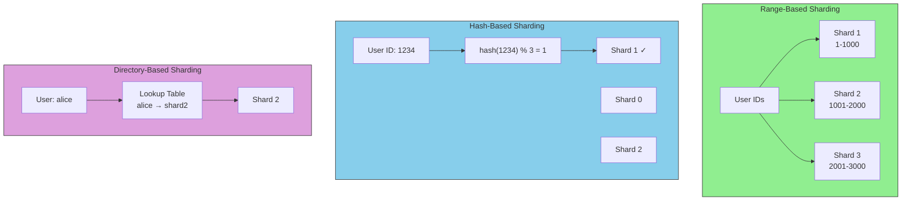
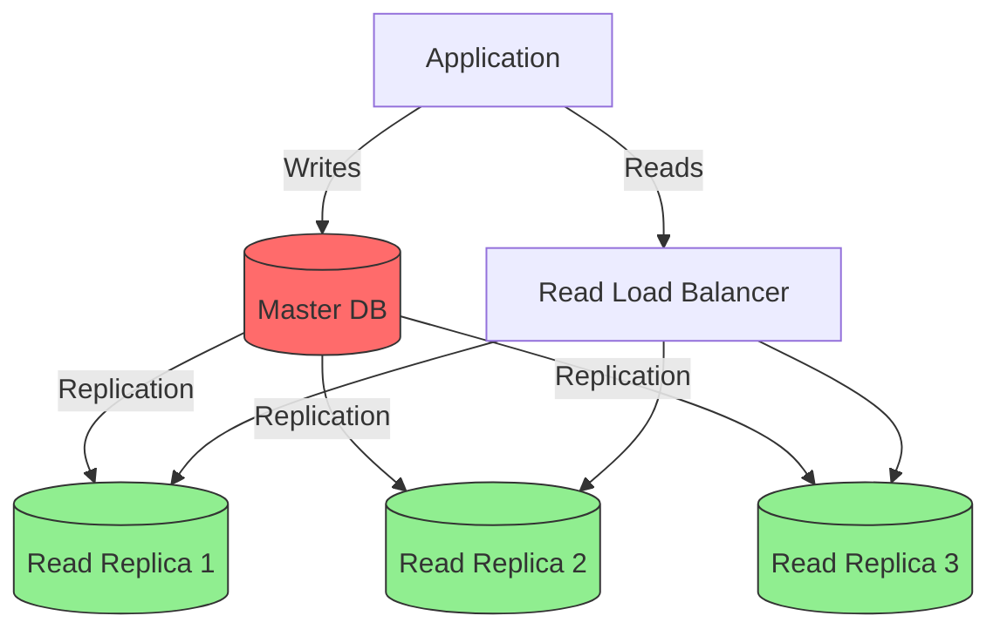
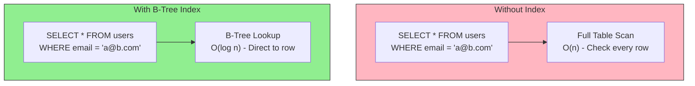
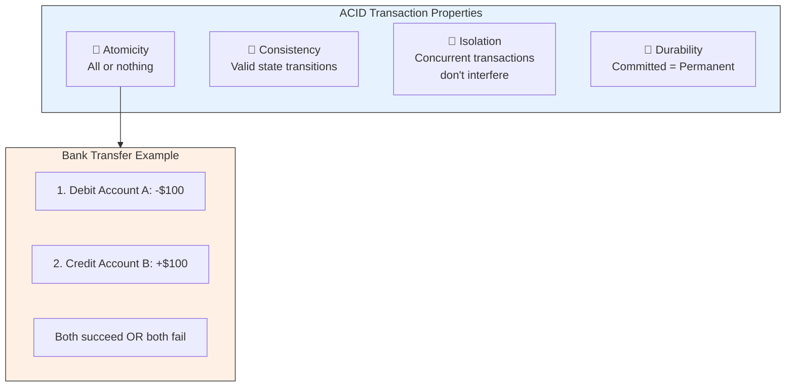

# Database Architecture Diagrams

## SQL vs NoSQL Decision Tree

```mermaid
flowchart TB
    Start["What are your data needs?"]
    
    Start --> Q1{"Need ACID<br/>transactions?"}
    Q1 -->|"Yes"| SQL1["Consider SQL"]
    Q1 -->|"No"| Q2{"Schema flexibility<br/>needed?"}
    
    Q2 -->|"Yes"| NoSQL1["Consider NoSQL"]
    Q2 -->|"No"| Q3{"Read-heavy<br/>workload?"}
    
    Q3 -->|"Yes"| NoSQL2["Consider NoSQL<br/>(with caching)"]
    Q3 -->|"No"| SQL2["Consider SQL"]
    
    SQL1 --> SQLOptions["PostgreSQL, MySQL,<br/>Aurora, CockroachDB"]
    SQL2 --> SQLOptions
    
    NoSQL1 --> NoSQLOptions["MongoDB, DynamoDB,<br/>Cassandra, Redis"]
    NoSQL2 --> NoSQLOptions
    
    style SQL1 fill:#4ecdc4,stroke:#333
    style SQL2 fill:#4ecdc4,stroke:#333
    style NoSQL1 fill:#ff6b6b,stroke:#333
    style NoSQL2 fill:#ff6b6b,stroke:#333
```

## Database Replication

```mermaid
flowchart TB
    subgraph Sync["Synchronous Replication"]
        direction LR
        W1["Write"] --> M1["Master"]
        M1 -->|"1. Write"| R1["Replica 1"]
        M1 -->|"2. Wait for ACK"| R1
        R1 -->|"3. ACK"| M1
        M1 -->|"4. Confirm"| W1
        SyncNote["✓ Strong consistency<br/>✗ Higher latency"]
    end
    
    subgraph Async["Asynchronous Replication"]
        direction LR
        W2["Write"] --> M2["Master"]
        M2 -->|"1. Confirm"| W2
        M2 -.->|"2. Async"| R2["Replica 1"]
        AsyncNote["✓ Low latency<br/>✗ Replication lag"]
    end
    
    style Sync fill:#e6f3ff,stroke:#333
    style Async fill:#fff0e6,stroke:#333
```

## Database Sharding Strategies

```mermaid
flowchart TB
    subgraph Range["Range-Based Sharding"]
        direction LR
        RData["User IDs"]
        RShard1["Shard 1<br/>1-1000"]
        RShard2["Shard 2<br/>1001-2000"]
        RShard3["Shard 3<br/>2001-3000"]
        RData --> RShard1
        RData --> RShard2
        RData --> RShard3
    end
    
    subgraph Hash["Hash-Based Sharding"]
        direction LR
        HData["User ID: 1234"]
        HHash["hash(1234) % 3 = 1"]
        HShard1["Shard 0"]
        HShard2["Shard 1 ✓"]
        HShard3["Shard 2"]
        HData --> HHash
        HHash --> HShard2
    end
    
    subgraph Dir["Directory-Based Sharding"]
        direction LR
        DData["User: alice"]
        DLookup["Lookup Table<br/>alice → shard2"]
        DShard["Shard 2"]
        DData --> DLookup --> DShard
    end
    
    style Range fill:#90EE90,stroke:#333
    style Hash fill:#87CEEB,stroke:#333
    style Dir fill:#DDA0DD,stroke:#333
```

## Read Replicas Pattern

```mermaid
flowchart TB
    App["Application"]
    
    App -->|"Writes"| Master[(Master DB)]
    
    Master -->|"Replication"| R1[(Read Replica 1)]
    Master -->|"Replication"| R2[(Read Replica 2)]
    Master -->|"Replication"| R3[(Read Replica 3)]
    
    App -->|"Reads"| LB["Read Load Balancer"]
    LB --> R1
    LB --> R2
    LB --> R3
    
    style Master fill:#ff6b6b,stroke:#333
    style R1 fill:#90EE90,stroke:#333
    style R2 fill:#90EE90,stroke:#333
    style R3 fill:#90EE90,stroke:#333
```

## Database Indexing

```mermaid
flowchart TB
    subgraph Without["Without Index"]
        direction LR
        Q1["SELECT * FROM users<br/>WHERE email = 'a@b.com'"]
        Scan["Full Table Scan<br/>O(n) - Check every row"]
        Q1 --> Scan
    end
    
    subgraph With["With B-Tree Index"]
        direction LR
        Q2["SELECT * FROM users<br/>WHERE email = 'a@b.com'"]
        BTree["B-Tree Lookup<br/>O(log n) - Direct to row"]
        Q2 --> BTree
    end
    
    style Without fill:#FFB6C1,stroke:#333
    style With fill:#90EE90,stroke:#333
```

## ACID Properties

```mermaid
flowchart TB
    subgraph ACID["ACID Transaction Properties"]
        direction TB
        
        A["🔷 Atomicity<br/>All or nothing"]
        C["🔷 Consistency<br/>Valid state transitions"]
        I["🔷 Isolation<br/>Concurrent transactions<br/>don't interfere"]
        D["🔷 Durability<br/>Committed = Permanent"]
    end
    
    subgraph Example["Bank Transfer Example"]
        E1["1. Debit Account A: -$100"]
        E2["2. Credit Account B: +$100"]
        E3["Both succeed OR both fail"]
    end
    
    A --> Example
    
    style ACID fill:#e6f3ff,stroke:#333
    style Example fill:#fff0e6,stroke:#333
```
