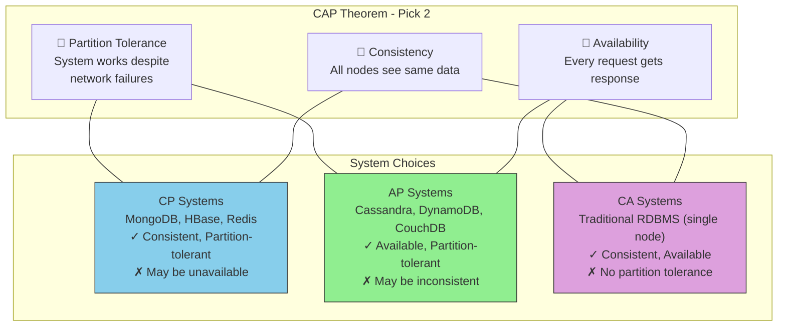
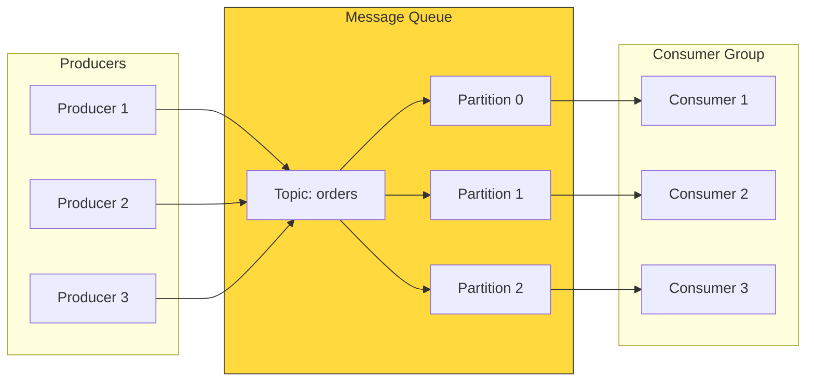
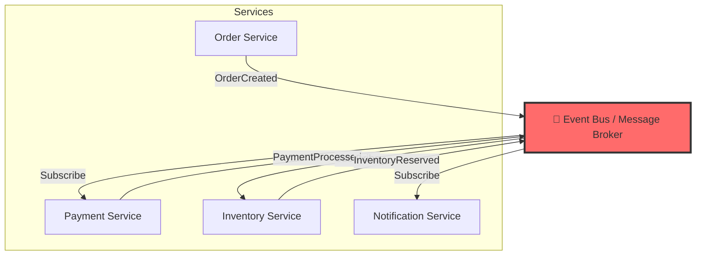
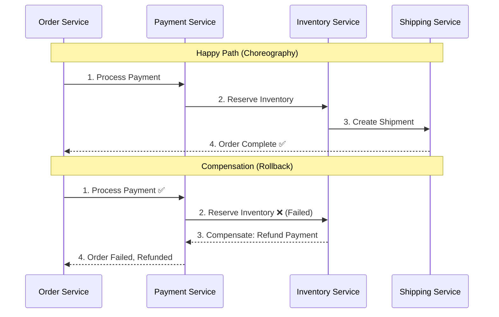
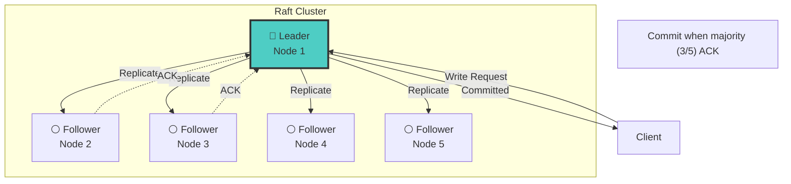
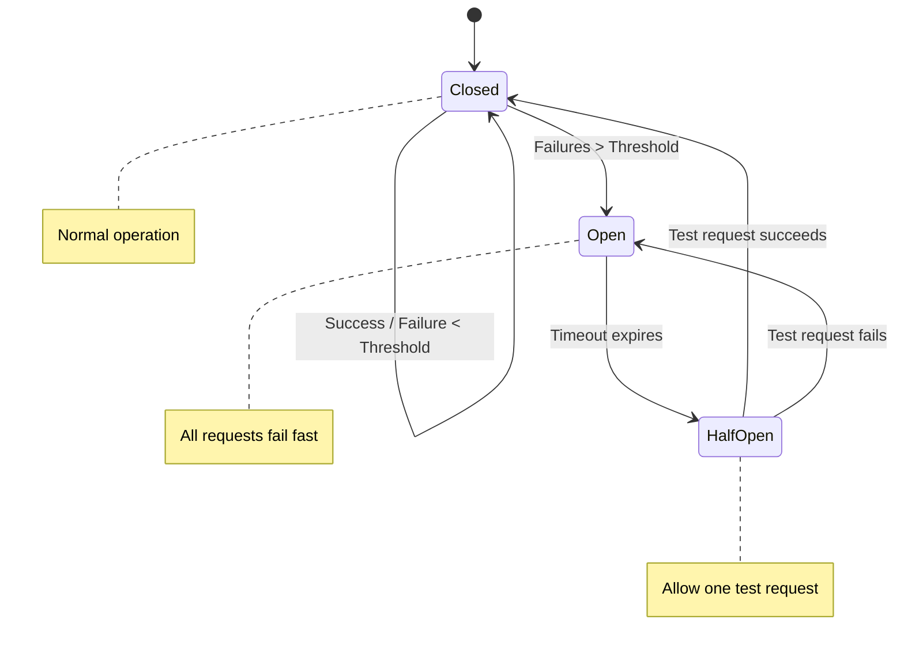
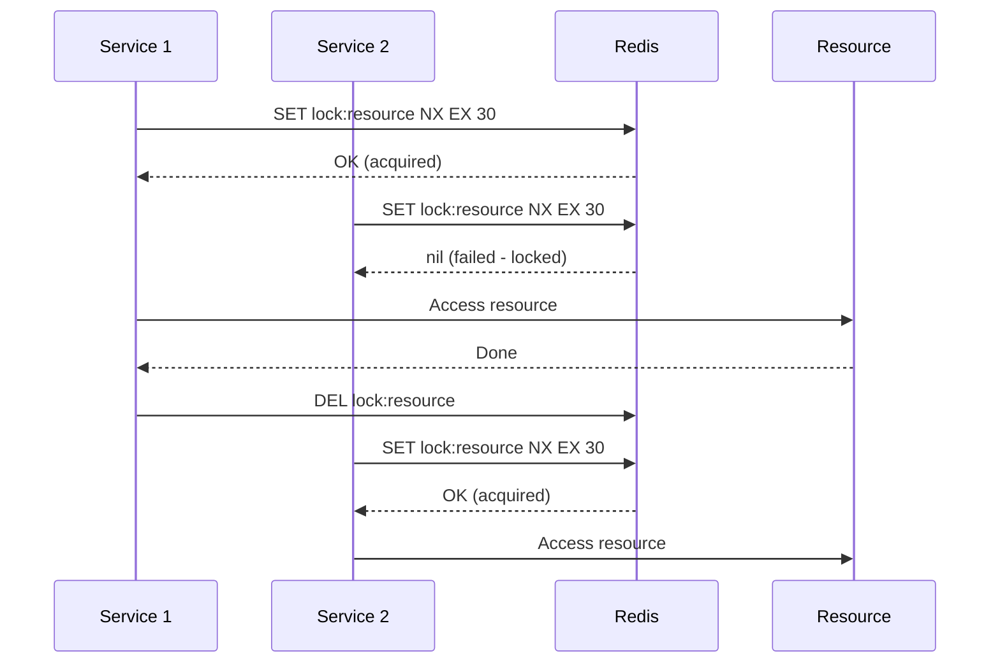
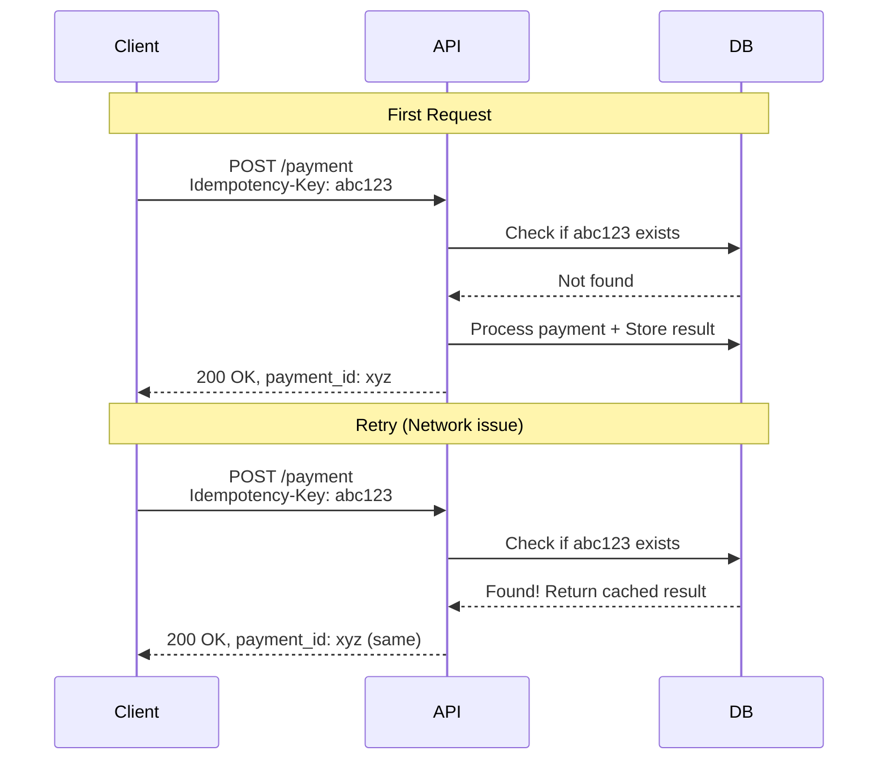

# Distributed Systems Diagrams

## CAP Theorem

## Message Queue Architecture

## Event-Driven Architecture

## Saga Pattern (Distributed Transactions)

## Consensus Algorithm (Raft)

## Circuit Breaker Pattern

## Distributed Locking

## Idempotency Key Pattern

