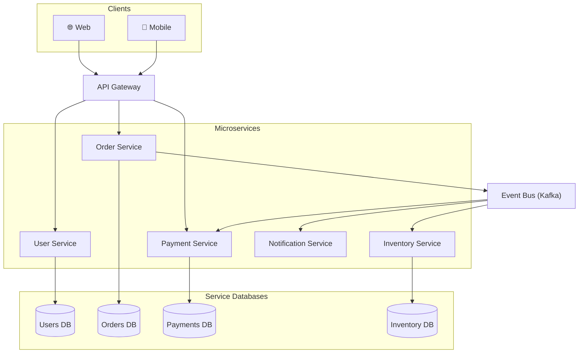
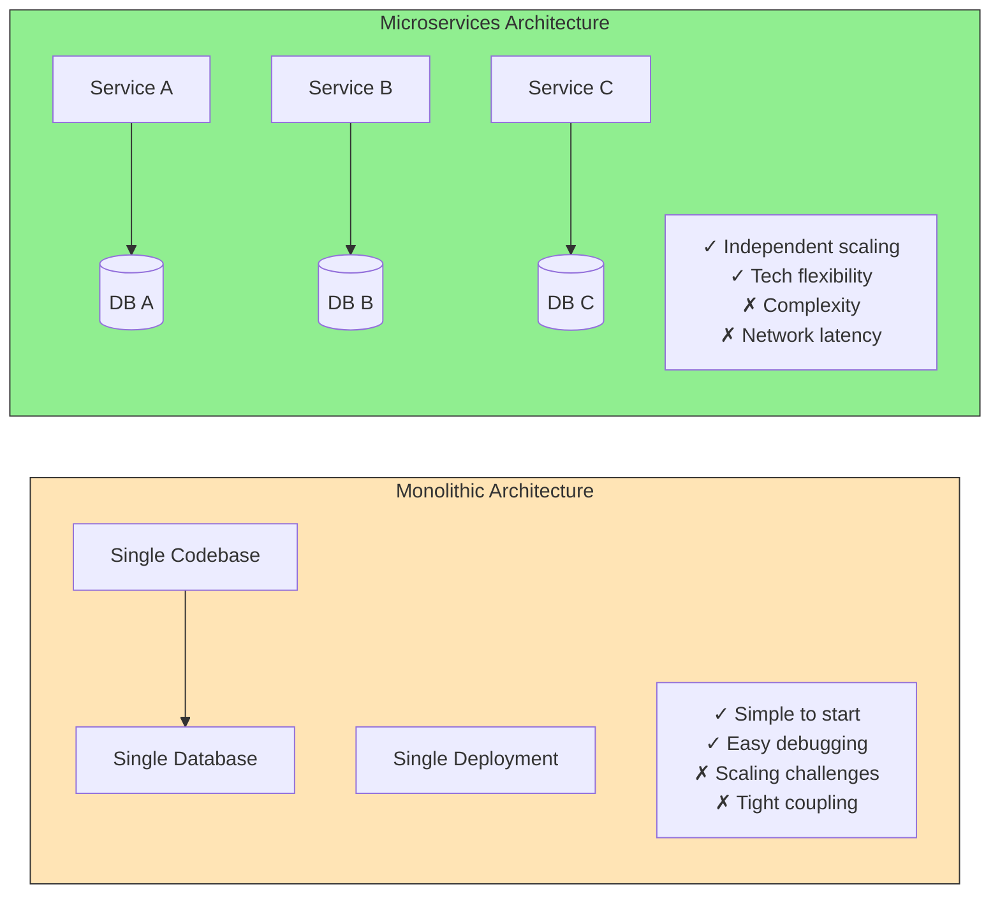
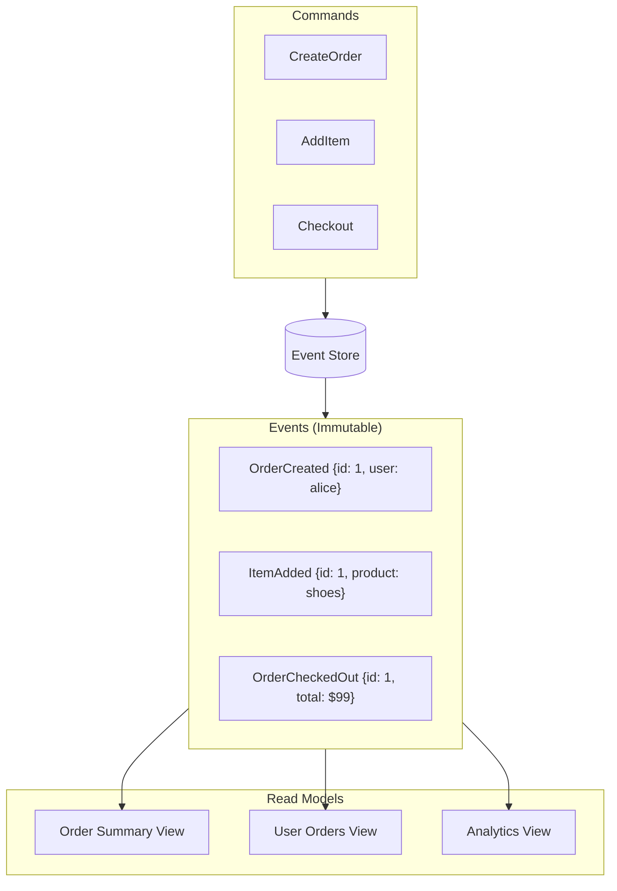
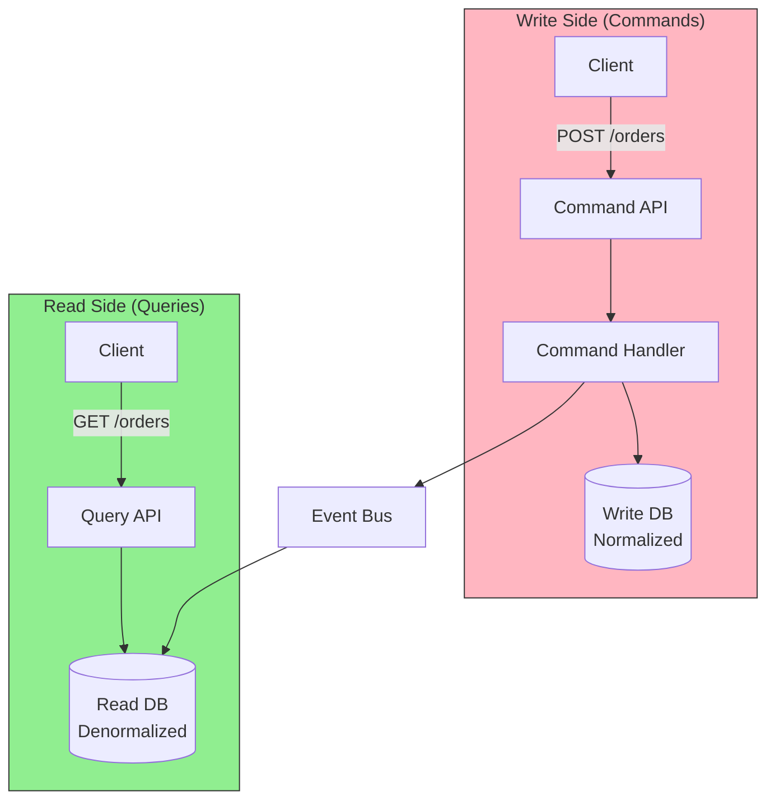
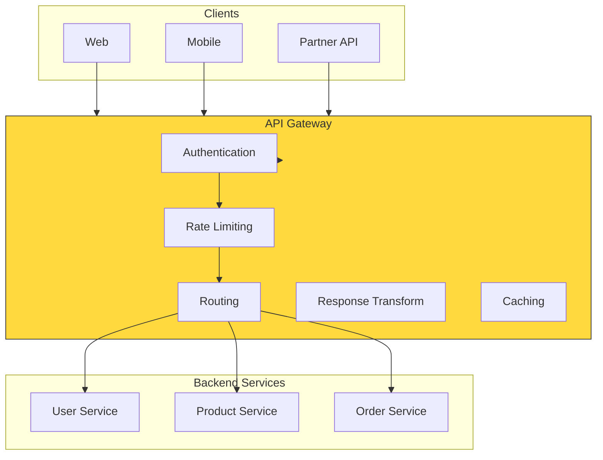
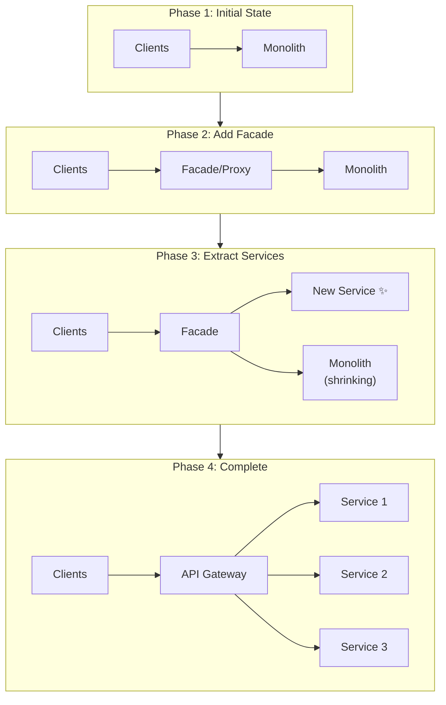
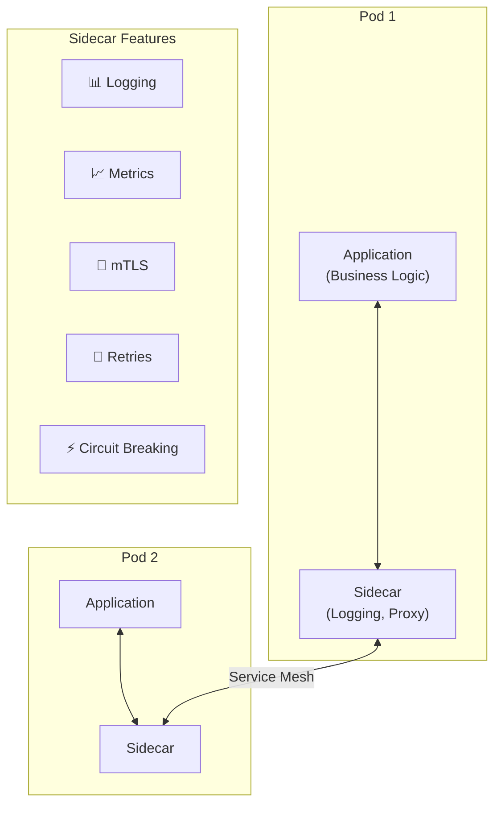
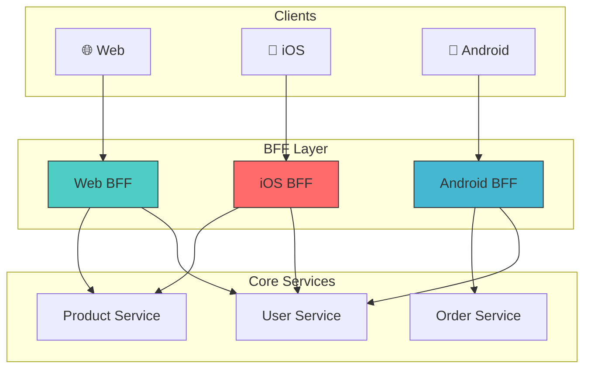

# Architecture Patterns Diagrams

## Microservices Architecture

## Monolith vs Microservices

## Event Sourcing

## CQRS (Command Query Responsibility Segregation)

## API Gateway Pattern

## Strangler Fig Pattern (Migration)

## Sidecar Pattern

## Backend for Frontend (BFF)

