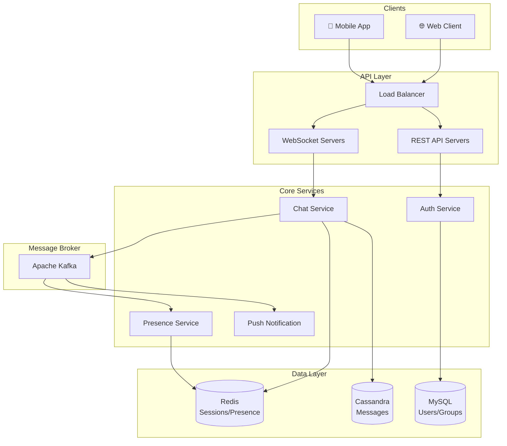
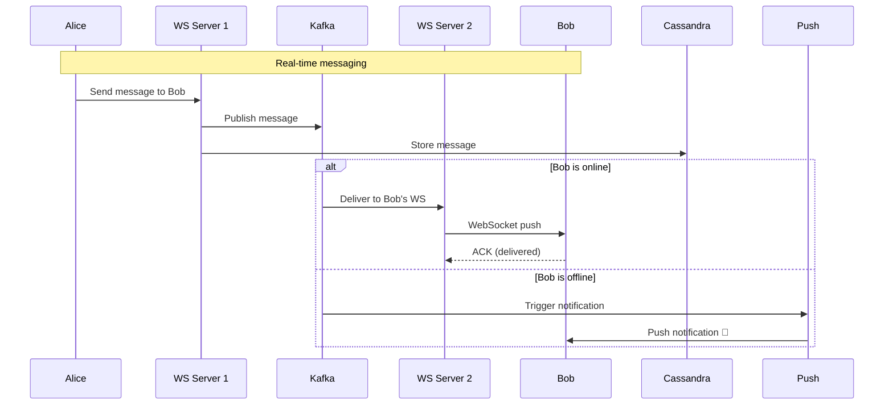
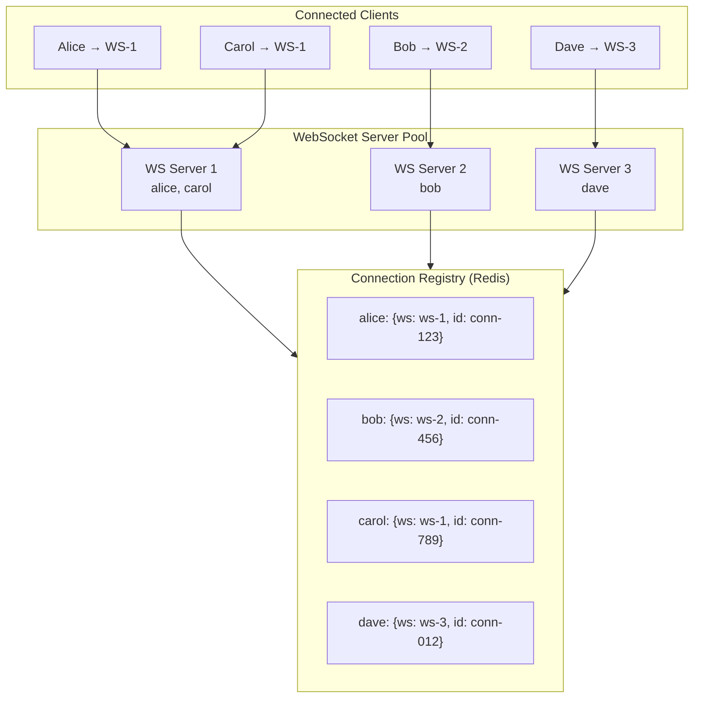
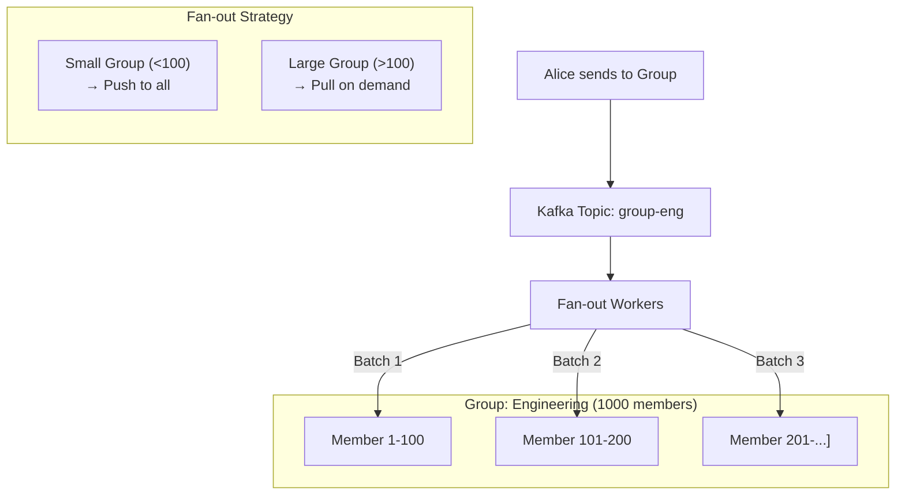
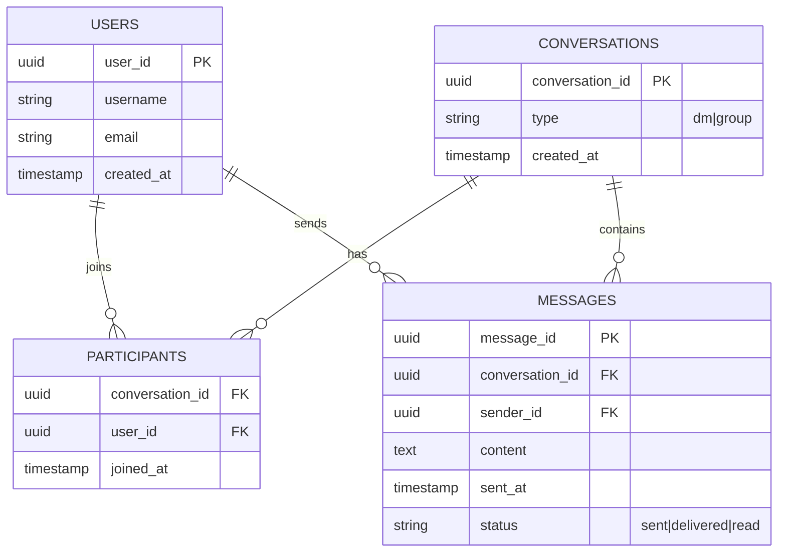
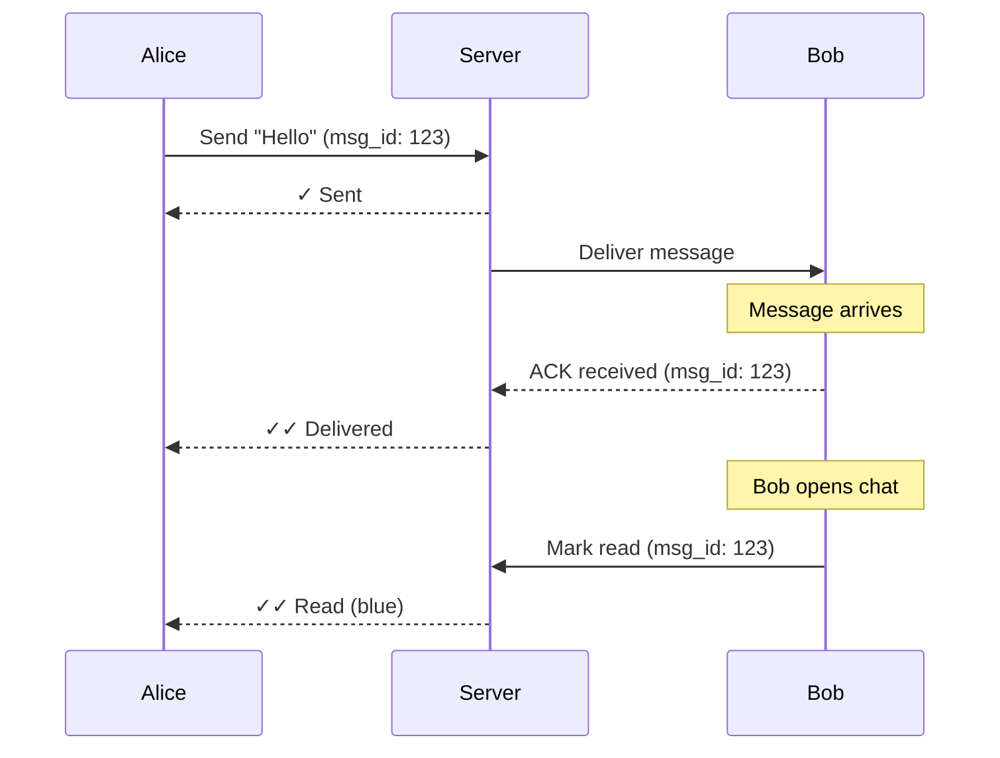

# Real-World Design: Chat System

## High-Level Architecture

## Message Flow

## WebSocket Connection Management

## Group Chat Message Fan-Out

## Message Storage Schema

## Read Receipts Flow

