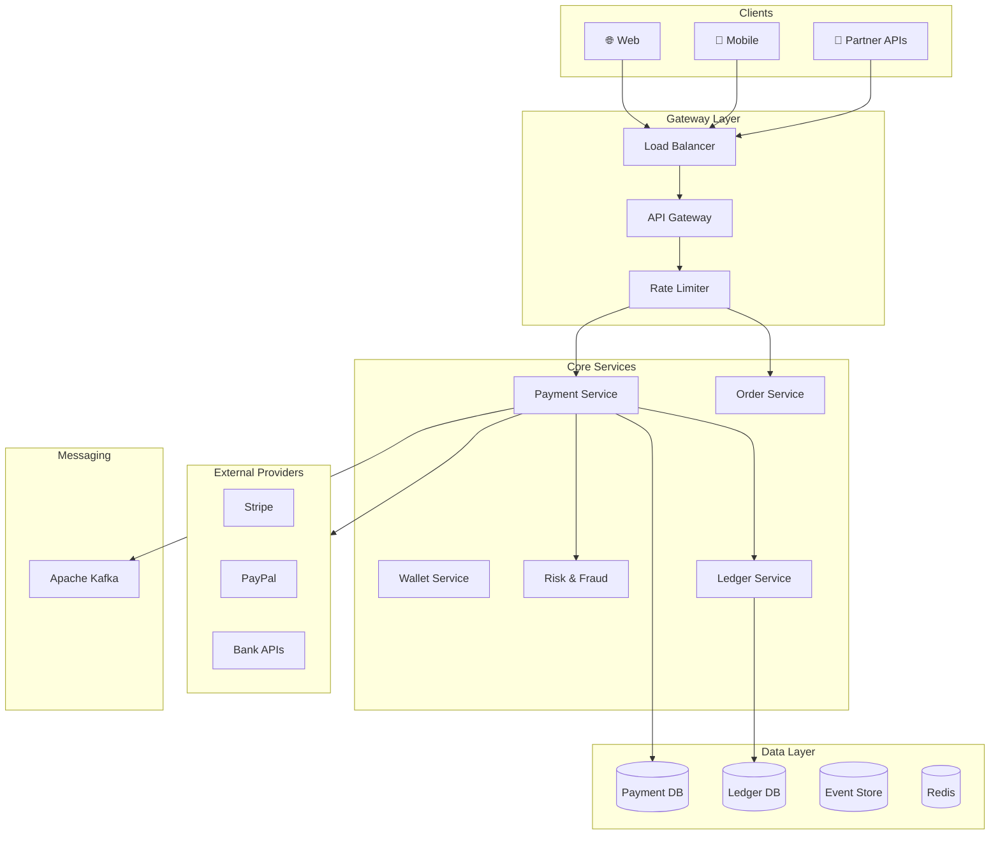
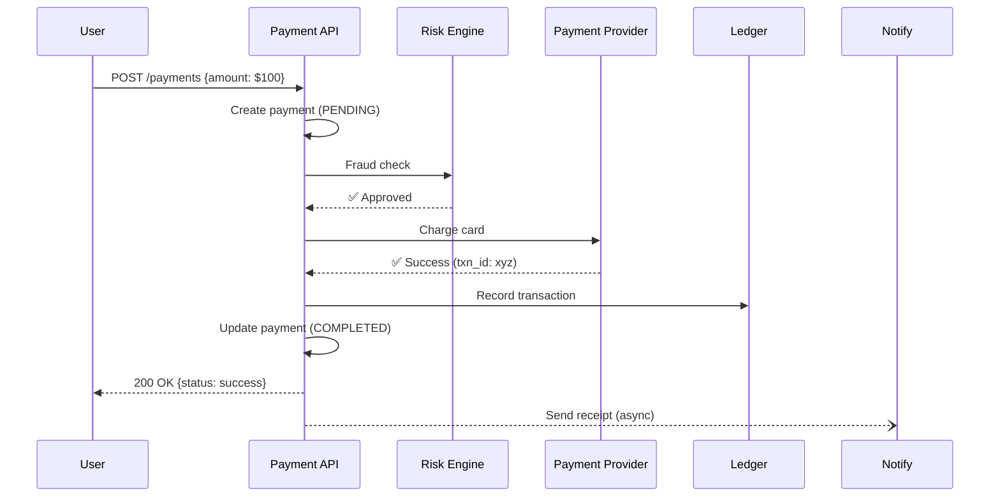
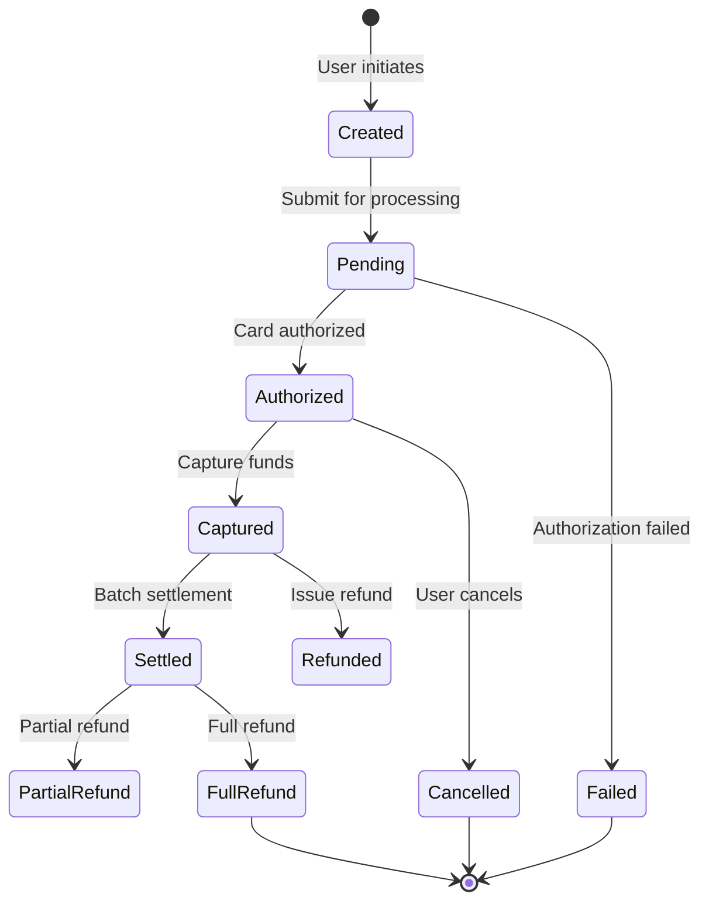
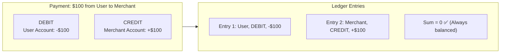
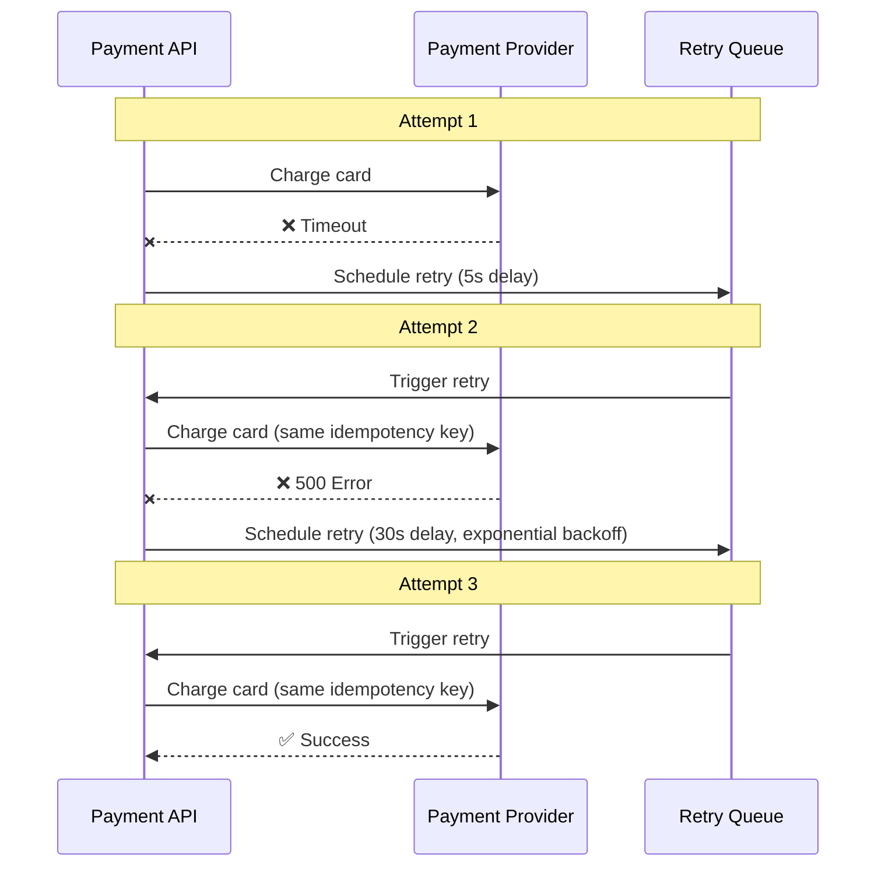
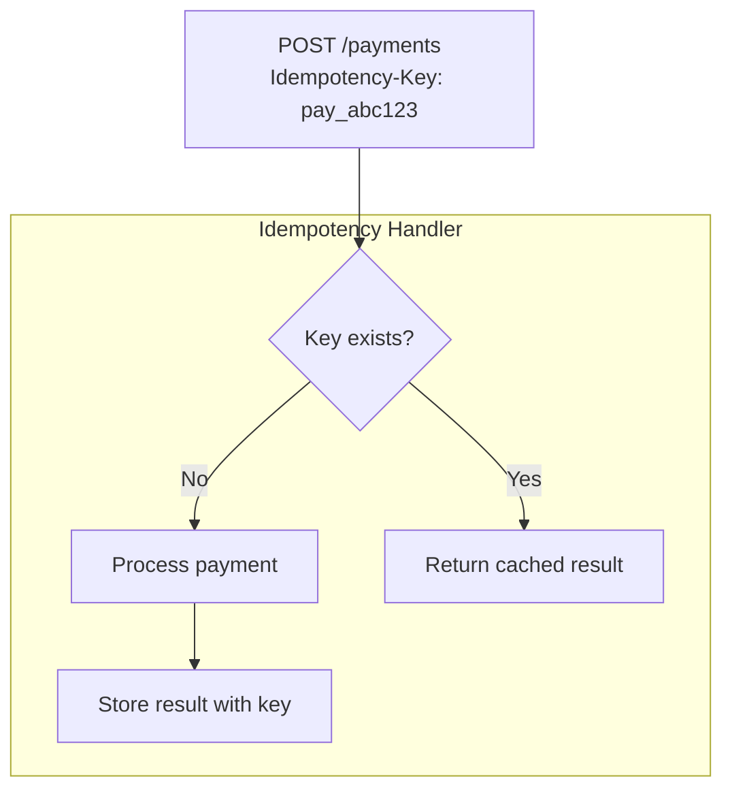
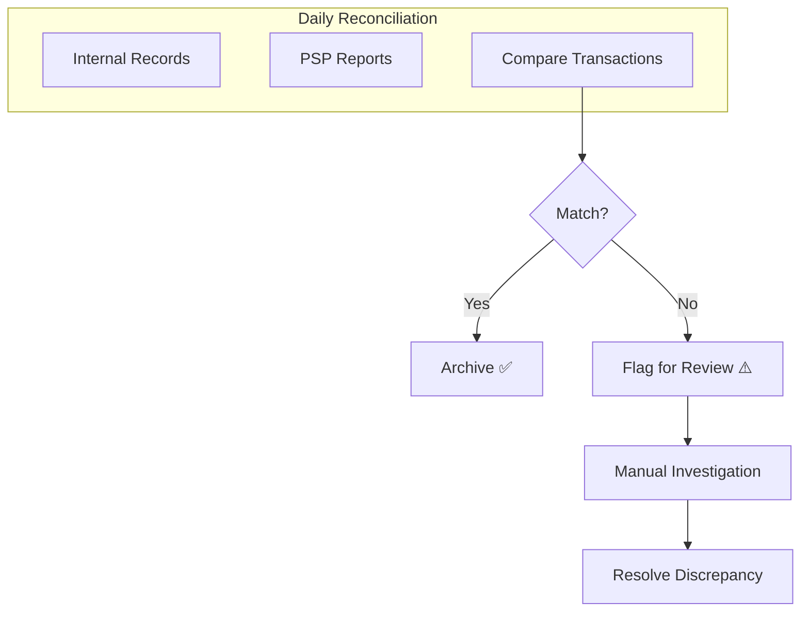
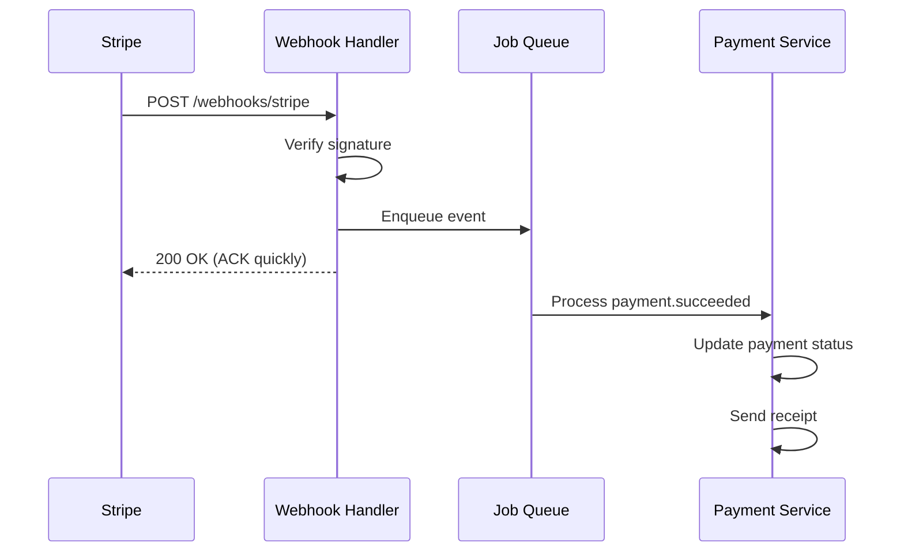
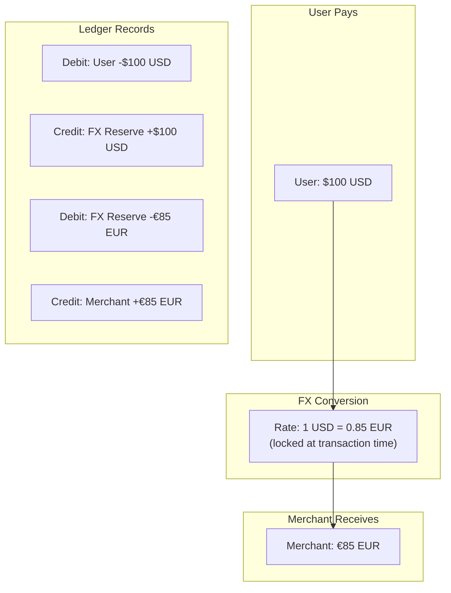

# Real-World Design: Payment System

## High-Level Architecture

## Payment Flow (Happy Path)

## Payment State Machine

## Double-Entry Ledger

## Handling Failures with Retries

## Idempotency Pattern

## Reconciliation Process

## Webhook Handling

## Multi-Currency Support

