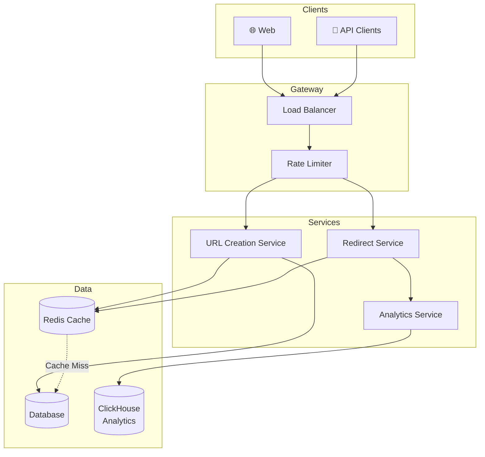
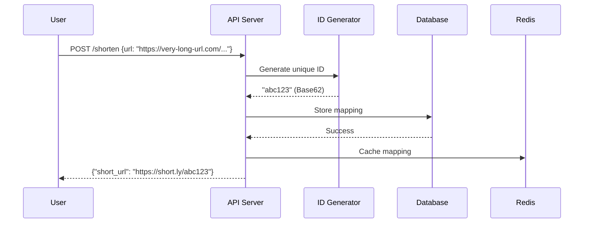
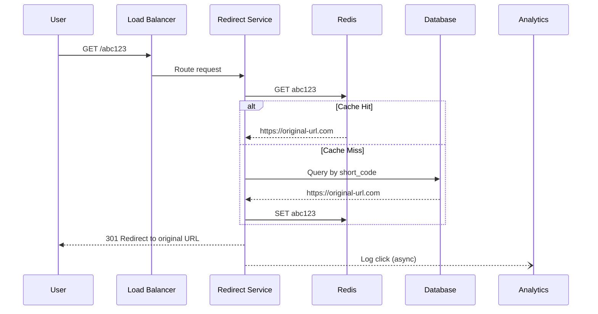
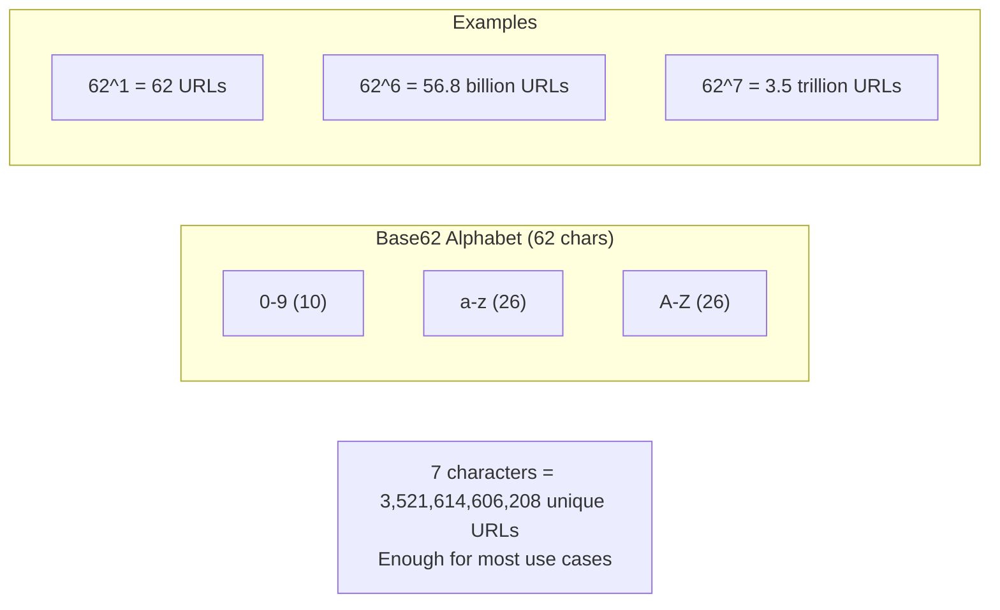
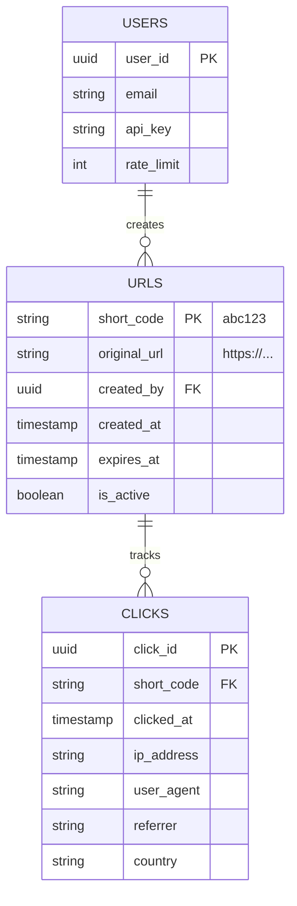
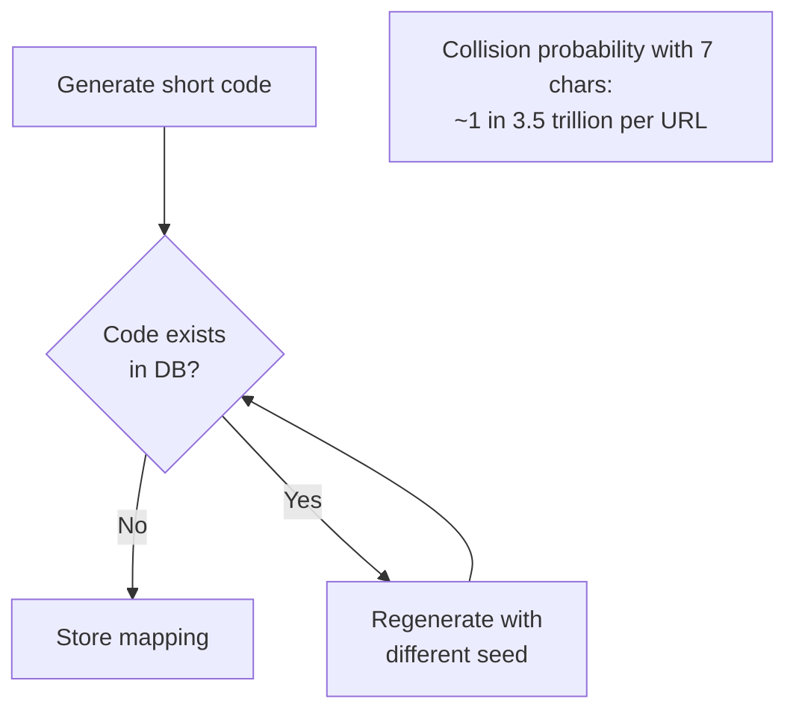
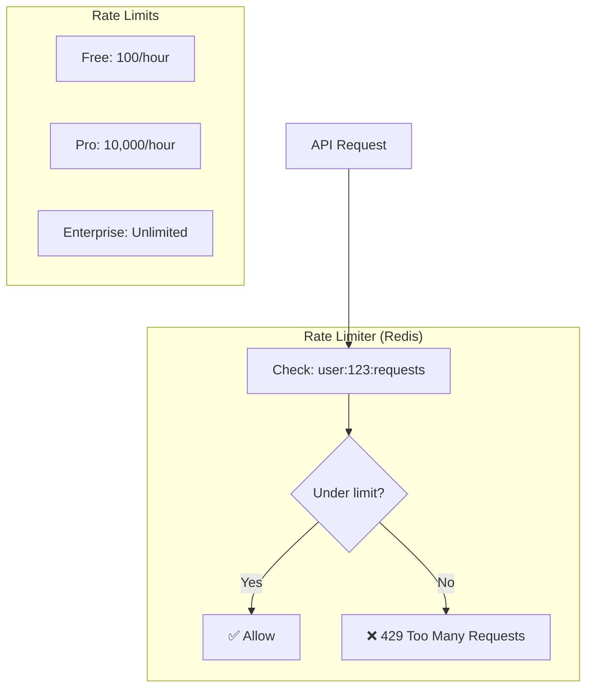

# Real-World Design: URL Shortener

## High-Level Architecture

## URL Shortening Flow

## Redirect Flow

## ID Generation Strategies

```mermaid
flowchart TB
    subgraph Strategy1["Counter + Base62"]
        direction LR
        Counter["Counter: 123456789"]
        Encode["Base62 Encode"]
        Result1["→ 8M0kX"]
        Counter --> Encode --> Result1
    end
    
    subgraph Strategy2["Hash Truncation"]
        direction LR
        URL["Long URL"]
        Hash["MD5/SHA256"]
        Truncate["First 7 chars"]
        Result2["→ 2cf24d"]
        URL --> Hash --> Truncate --> Result2
    end
    
    subgraph Strategy3["Pre-generated Keys"]
        direction LR
        KeyDB["Key Database<br/>(Pre-generated pool)"]
        Claim["Claim unused key"]
        Result3["→ Xk39Mn"]
        KeyDB --> Claim --> Result3
    end
    
    style Strategy1 fill:#90EE90,stroke:#333
    style Strategy2 fill:#87CEEB,stroke:#333
    style Strategy3 fill:#DDA0DD,stroke:#333
```

## Base62 Encoding

## Data Model

## Handling Collisions

## Rate Limiting

