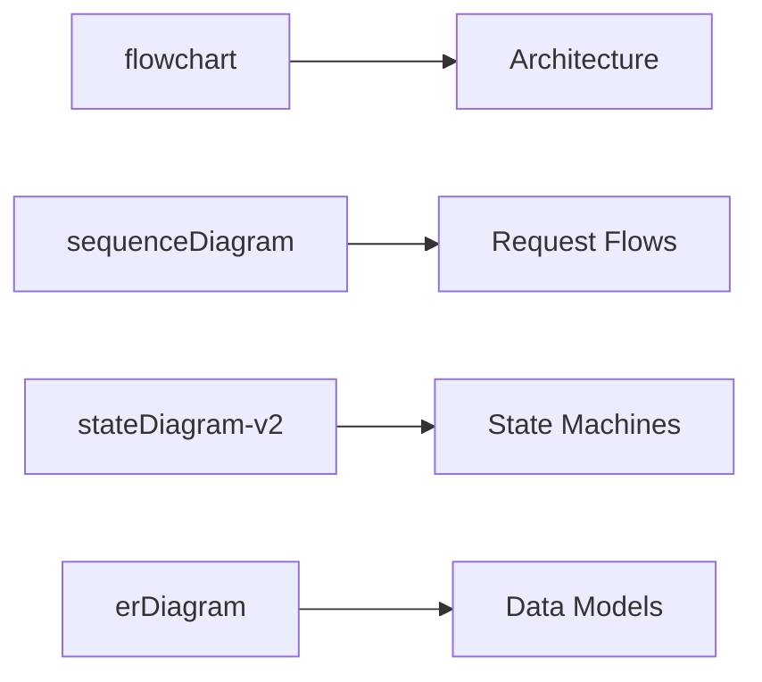

# System Design Diagrams

This folder contains reference diagrams for architecture concepts. All diagrams are created using **Mermaid**, which renders natively on GitHub.

**Note:** Diagrams are now also embedded directly in the chapter content files for easier learning. This folder serves as a consolidated reference.

📊 **See [DIAGRAM-INDEX.md](DIAGRAM-INDEX.md) for a complete catalog of all 41+ embedded diagrams across the repository.**

## How to View

These diagrams render automatically when viewing on GitHub. If viewing locally, you can:
- Use a Mermaid-compatible Markdown viewer
- Install the [Mermaid Preview](https://marketplace.visualstudio.com/items?itemName=bierner.markdown-mermaid) VS Code extension
- Copy diagrams to [Mermaid Live Editor](https://mermaid.live)

---

## Diagram Index

### Level 01 - Foundation
| File | Topics Covered |
|------|----------------|
| [01-foundation-client-server.md](01-foundation-client-server.md) | Client-server model, request-response cycle, three-tier architecture, stateless vs stateful |
| [01-foundation-internet-flow.md](01-foundation-internet-flow.md) | DNS resolution, URL flow, OSI model, TCP handshake, HTTP vs HTTPS |

### Level 02 - Core Concepts
| File | Topics Covered |
|------|----------------|
| [02-core-concepts-scalability.md](02-core-concepts-scalability.md) | Horizontal vs vertical scaling, stateless architecture, latency numbers, availability nines |

### Level 03 - Building Blocks
| File | Topics Covered |
|------|----------------|
| [03-building-blocks-load-balancer.md](03-building-blocks-load-balancer.md) | Load balancer architecture, algorithms, L4 vs L7, health checks, HA setup |
| [03-building-blocks-caching.md](03-building-blocks-caching.md) | Cache-aside, write-through, write-behind, multi-level caching, eviction, stampede |
| [03-building-blocks-cdn.md](03-building-blocks-cdn.md) | CDN architecture, push vs pull, cache headers, origin shield, invalidation |

### Level 04 - Data Layer
| File | Topics Covered |
|------|----------------|
| [04-data-layer-databases.md](04-data-layer-databases.md) | SQL vs NoSQL, replication, sharding, read replicas, indexing, ACID |

### Level 05 - Distributed Systems
| File | Topics Covered |
|------|----------------|
| [05-distributed-systems.md](05-distributed-systems.md) | CAP theorem, message queues, event-driven, saga pattern, consensus, circuit breaker, locking |

### Level 06 - Architecture Patterns
| File | Topics Covered |
|------|----------------|
| [06-architecture-patterns.md](06-architecture-patterns.md) | Microservices, event sourcing, CQRS, API gateway, strangler fig, sidecar, BFF |

### Level 07 - Real-World Designs
| File | Topics Covered |
|------|----------------|
| [07-real-world-chat-system.md](07-real-world-chat-system.md) | Chat architecture, message flow, WebSocket management, group fan-out, read receipts |
| [07-real-world-url-shortener.md](07-real-world-url-shortener.md) | URL shortener architecture, ID generation, Base62, redirect flow, rate limiting |
| [07-real-world-payment-system.md](07-real-world-payment-system.md) | Payment flow, state machine, double-entry ledger, idempotency, reconciliation |

---

## Naming Convention

```
[level]-[topic]-[description].md

Examples:
01-foundation-client-server.md
07-real-world-chat-system.md
```

---

## Creating New Diagrams

When adding new diagrams:

1. Follow the naming convention above
2. Use Mermaid for all diagrams (renders on GitHub)
3. Include a header with # title
4. Group related diagrams in the same file
5. Add descriptive comments before complex diagrams
6. Update this README with the new file

### Mermaid Diagram Types



---

## Contributing

See the main [contribution guide](../../community/contribute.md) for guidelines on adding diagrams.
